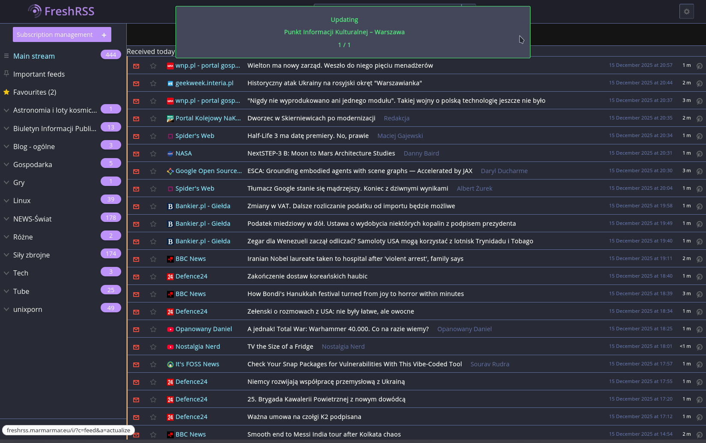
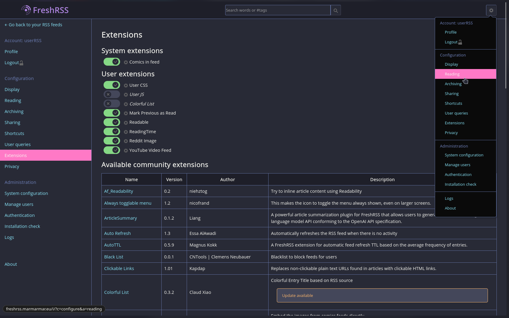
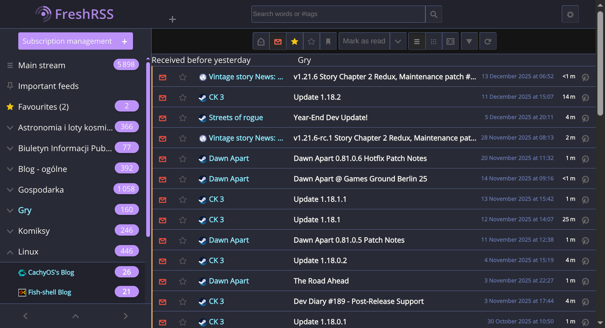
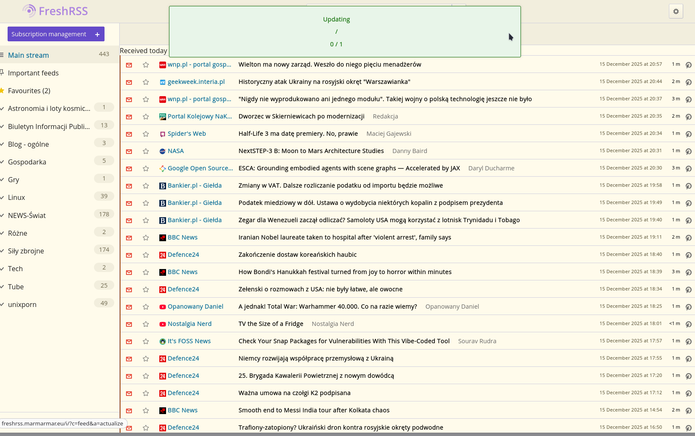
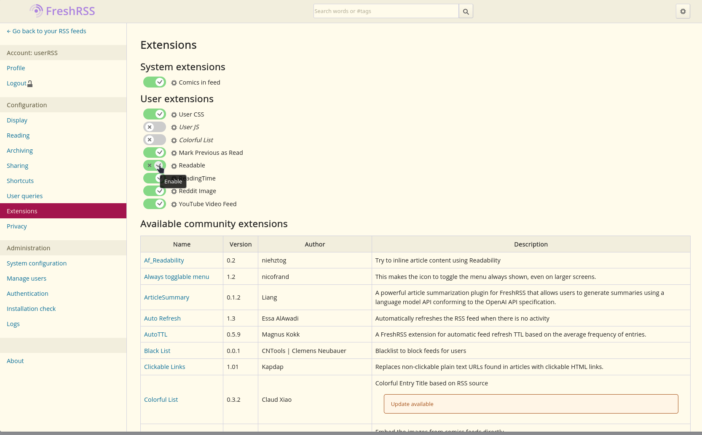
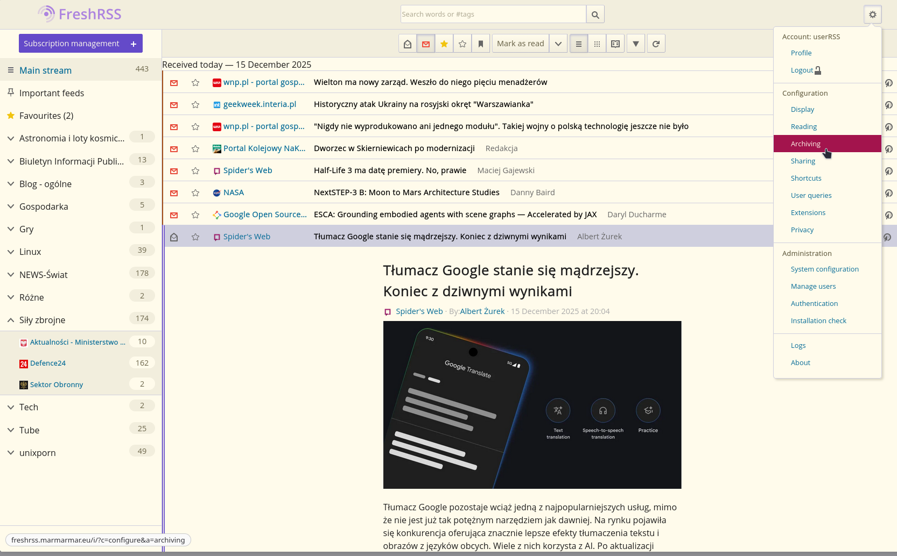
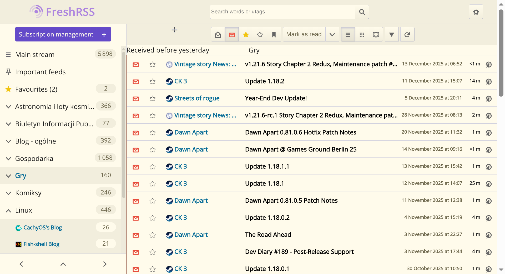

# Dracula for [Freshrss](https://www.freshrss.org)

> A dark & light theme for [Freshrss](https://www.freshrss.org).

## Gallery

  
📸 Click to view Screenshots

### Main View

### Settings

### Article

### Main View

### Main View

### Settings

### Article

### Main View

## Install

All instructions can be found at [draculatheme.com/foobar](https://draculatheme.com/freshrss).

## Team

This theme is maintained by the following person(s) and a bunch of [awesome contributors](https://github.com/dracula/freshrss/graphs/contributors).

|  |
| ---------------------------------------------------------------------------------------------- |
| [Marek M. Marecki](https://github.com/marek2001)                                               |

## Community

- [Twitter](https://twitter.com/draculatheme) - Best for getting updates about themes and new stuff.
- [GitHub](https://github.com/dracula/dracula-theme/discussions) - Best for asking questions and discussing issues.
- [Discord](https://draculatheme.com/discord-invite) - Best for hanging out with the community.

## Dracula PRO

## License

[MIT License](./LICENSE)
